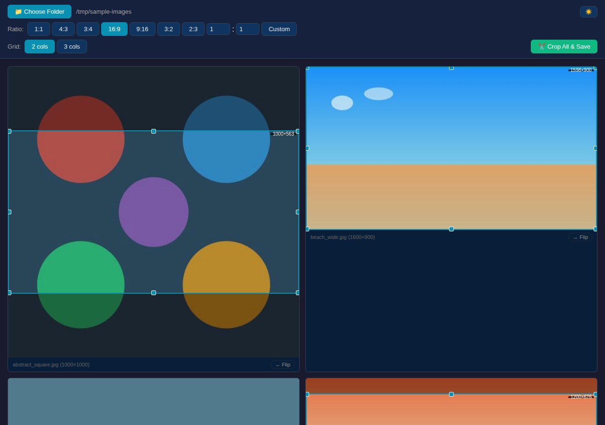

# FrameCrop

A Pinokio 7.x app for batch-cropping images to a chosen aspect ratio using a draggable/resizable crop overlay on each image thumbnail.



## Features

- **Folder browser** – Browse and select any local folder containing images
- **Aspect ratio presets** – 1:1, 4:3, 3:4, 16:9, 9:16, 3:2, 2:3, or custom W:H
- **Flip ratio** – Per-image button to swap W↔H on the current ratio
- **Draggable & resizable crop overlay** – 8 handles (corners + edges) with locked aspect ratio, clamped to image bounds
- **Grid density** – Toggle between 2 or 3 images per row
- **Batch crop & save** – Crops all images at once, saving into a `cropped/` subfolder
- **Dark/Light theme** – Toggle via the header button
- **Pixel-accurate cropping** – Overlay coordinates convert between thumbnail display space and original resolution

## Installation (via Pinokio)

1. Clone or download this repository into your Pinokio `api/` folder.
2. Open Pinokio and find **FrameCrop** in the app list.
3. Click **Install** — this runs `npm install` to fetch dependencies (`express`, `jimp`).
4. Click **Start** — launches the Express server and opens the web UI.

## Manual Usage (without Pinokio)

```bash
npm install
npm start
```

Then open `http://localhost:3456` in your browser.

## Troubleshooting

### "Cannot find module 'express'" or similar errors

This means Node.js dependencies are not installed. Run:

```bash
npm install
```

If the problem persists, try a clean reinstall:

```bash
rm -rf node_modules package-lock.json
npm install
```

## How It Works

1. Click **Choose Folder** and navigate to a folder containing images (JPG, PNG, WebP).
2. Select an aspect ratio from the presets or enter a custom ratio.
3. Each image shows a crop overlay (largest fitting rectangle of the target ratio, centered).
4. Drag the overlay to reposition, or drag any handle to resize (aspect ratio stays locked).
5. Use the **↔ Flip** button per-image to swap width and height.
6. Click **Crop All & Save** — cropped images are saved to a `cropped/` subfolder inside the source folder.

## API Endpoints

| Endpoint | Method | Description |
|----------|--------|-------------|
| `/api/browse?path=...` | GET | List folders at a given path |
| `/api/images?folder=...` | GET | List image files with dimensions |
| `/api/thumb?folder=...&file=...` | GET | Serve resized thumbnail (max 500px) |
| `/api/crop` | POST | Batch crop images (JSON body with `jobs` array) |

## Tech Stack

- **Backend:** Node.js, Express, Jimp (pure JavaScript – no native binaries)
- **Frontend:** Vanilla HTML/CSS/JS (no build step)
- **Pinokio:** 7.x compatible scripts (`pinokio.js`, `install.js`, `start.js`, `reset.js`)